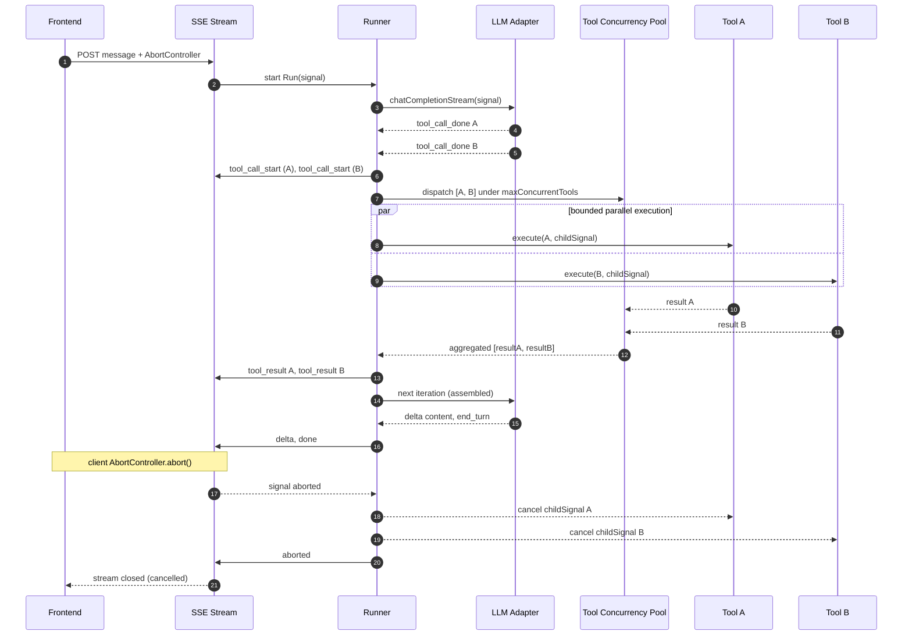

# RFC: Agent Loop v2

- 状态：**Proposal**
- 作者：Sisyphus-Junior (T2)
- 日期：2026-08-09
- 依赖：`_current-state-baseline.md` (T0)、`_architecture-decisions.md` (T1，决策 A1-A5、B6、B7)
- 配套工件：
  - 类型：`docs/rfc/types/agent-loop-v2.d.ts`
  - JSON Schema：`docs/rfc/agent-loop-v2.schema.json`
  - 图表：`docs/rfc/diagrams/agent-loop-v2.mmd`

本 RFC 规范化 MyCopilot 的 **Agent Loop v2** 协议：在现有单 Agent 循环之上（按决策 B6，不引入模式状态机），结合消费级 ChatGPT/Claude 聊天循环与生成式 Bolt/v0 风格的 Agent 行为。本文档仅为设计文档，不会修改 `apps/` 或 `packages/` 下的任何代码。

## 动机

当前 `apps/server/src/agent-loop/runner.ts`（552 行）通过 LLM 调用与工具执行的 `while` 循环驱动助手。它能工作，但暴露了三类阻碍 `docs/2026-06-20-fullstack-agent-upgrade-design.md`（Phase 2/3）中描述的生成式、长时运行、工具密集型体验的问题：

1. **生命周期隐式。** Run 只是一个 async 函数。其状态（`completed` / `length_limited` / `max_iterations` / `aborted` / `error`）仅在结束时返回一次。前端无法以结构化方式询问"Run 当前在哪一步？"或"是否在等待用户？"没有持久化、可查询的 `Run` 及其状态转换的概念。
2. **护栏粗放。** 循环唯一的防护是 `MAX_SAME_TOOL_CALLS = 3`（`runner.ts:265`），且**按 Run 计数**（`toolCallCounts` map 在 `runAgentLoop` 内部初始化）。还有 `DEFAULT_MAX_ITERATIONS = 10` 步数上限和基于 token 的摘要器（`DEFAULT_SUMMARY_THRESHOLD = 30_000`），但它们是分散的常量，并非一个连贯的防护。参数相似度检测、token 预算路由和用户中断路由都不是一等概念。
3. **缺少显式推理通道。** 模型越来越多地输出扩展思考。当前这些文本会被拼接进 `delta` SSE 事件，渲染时与助手回答混在一起。前端无法区分"这是我的推理"和"这是我的回答"，而这正是 Frontend Response Renderer 扩展点（A3）和单循环 + 模式提示模型（B6）所需要的。

Agent Loop v2 将 Run 提升为一等实体，配备显式状态机、统一的防护层、路由化的 stop_reason 表和向后兼容的推理通道——同时**扩展**（绝不重新定义）现有的 11 个 SSE 事件（`sse-protocol.ts:2-13`），并保持**与供应商无关**。

## 目标

1. 定义 OpenAI Assistants 风格的 **Run 生命周期**（`queued → in_progress → requires_action → completed/cancelled/failed/incomplete/expired`），并将每个转换映射到现有 SSE 事件。
2. 规范化**并发工具调用**，每个 Run 有并发上限和失败聚合，替换 `runner.ts:376` 处隐式的 `Promise.all`。
3. 规范化与 `delta` 事件向后兼容的 **Extended Thinking** 暴露方式。
4. 规范化从前端 `AbortController` 一路传递到每个工具调用的 **AbortSignal 全链路传播**。
5. 将循环防护升级为 **LoopGuard v2**：步数上限、重复调用检测（名称 + 参数相似度）、token 预算路由、用户中断路由。
6. 定义显式的 **stop_reason 路由表**。
7. 定义**前端 Run 进度状态机**（B6：不是 chat/generate 模式切换——而是 SSE 事件的可推导投影）。

## 非目标

以下内容明确不在范围内，先在此声明，以避免规范部分意外将其纳入：

- **多 Agent / 集群 / 子 Agent 图。** MyCopilot 运行单循环。决策 B6 选择"单循环 + 模式提示"而非任何编排拓扑。集群运行时属于另一份未来的 RFC。
- **Computer Use、Voice 或后台守护进程。** v2 循环是请求/响应模式（已有的 `runAgentLoopAsJob` 提供了可选的后台作业模式）。本 RFC 不引入 always-on 的 Agent 进程。
- **破坏现有 11 个 SSE 事件。** `placeholder`、`delta`、`done`、`error`、`aborted`、`tool_call_start`、`tool_call_delta`、`tool_call_done`、`tool_result`、`confirmation_required`、`job_status` 已冻结。v2 仅**新增可选字段**或从现有事件中派生新含义。
- **假设特定的 LLM 供应商。** 所有调用都通过 `ProviderAdapter`（`llm/base.ts`）路由。OpenAI、Anthropic 和 Ollama 兼容的服务器都必须满足本规范。
- **代码 Agent 能力。** 不引入代码库索引、apply-model、LSP、AST patching。工具仍是通过现有 `tools/registry.ts` 注册的黑盒函数。
- **Artifact 子系统。** 按 B7，仅 Frontend Response Renderer 协议在其他范围内；本 RFC 不定义 Artifact 的版本化或存储。
- **MCP 传输扩展。** 仅支持 `stdio`（`mcp/transport-factory.ts:12-24`）；HTTP/SSE 的 MCP 传输仍延后。

## 规范

本节覆盖全部七个设计要点。类型定义位于 `docs/rfc/types/agent-loop-v2.d.ts`；JSON Schema 位于 `docs/rfc/agent-loop-v2.schema.json`；图表位于 `docs/rfc/diagrams/agent-loop-v2.mmd`。

### 1. Run 生命周期状态机

**Run** 是一次助手调用（一个用户回合，可能包含多个内部步骤）的顶层执行单元。其生命周期是一个显式状态机（见 `docs/rfc/diagrams/agent-loop-v2.mmd` 中的第一张图）：

```text
queued -> in_progress -> requires_action -> in_progress (approved)
                         requires_action -> expired (confirmation timeout)
in_progress -> completed | incomplete | cancelled | failed
```

状态：

- `queued` —— Run 记录已创建，尚未进入循环。
- `in_progress` —— 循环迭代中：LLM 流已打开或工具正在执行。
- `requires_action` —— 某个工具需要用户确认（对应 `confirmation_required` SSE 事件）。此处复用现有的 `requestToolApproval` / `confirmation.ts` 流程（`executor.ts:69-86`）以及 `setJobWaitingForConfirmation` 作业钩子（`runner.ts:535`）。Run 暂停；恢复需要走现有的审批端点。
- `completed` —— `stop_reason = end_turn`。
- `cancelled` —— `stop_reason = user_interrupt`（AbortSignal 触发）。
- `failed` —— `stop_reason = error`。
- `incomplete` —— `stop_reason = max_tokens` 或 `max_steps`（替代 v1 的 `length_limited` 和 `max_iterations` 状态）。
- `expired` —— 一个 `requires_action` 的确认在用户响应前超时。

**SSE 映射（扩展，而非重新定义）。** 不引入新的事件类型。Run 状态转换通过复用现有事件来暴露：

| Run 状态转换 | 复用的现有 SSE 事件 |
| --- | --- |
| `queued -> in_progress` | `placeholder`（msgId） |
| 流式 token | `delta`（content） |
| 工具调用开始 | `tool_call_start`（index） |
| 工具调用参数流 | `tool_call_delta`（`argumentsDelta`）—— 类似于 Anthropic 的 `input_json_delta` |
| 工具调用完成 | `tool_call_done`（id、name、arguments） |
| 工具结果就绪 | `tool_result`（toolCallId、result、isError） |
| `-> requires_action` | `confirmation_required`（approvalId、expiresAt、safetyLevel） |
| `requires_action -> expired` | 带有 `code: "confirmation_expired"` 的 `error` |
| 终态 | `done`（completed）、`aborted`（cancelled）、`error`（failed/incomplete 通过 `done` 暴露，并在**可选**新增字段中以 `stop_reason` 提示） |

唯一的增量变更是 `DoneEvent` 上一个**可选的** `stopReason` 字段（缺省 = `end_turn`，默认值）。忽略它的客户端继续可用；新客户端可区分 `incomplete`/`max_steps`。这满足"扩展而非重新定义"。

### 2. 并发工具调用

v1 已经在 `runner.ts:376` 用 `Promise.all` 展开，但没有上限、没有按调用隔离的取消、也没有失败聚合。v2 将其规范化：

- **Tool Concurrency Pool** 执行一个 `llm_call` 步骤产生的工具调用。其大小由 `LoopGuardConfig.maxConcurrentTools`（默认 4）限制。超出上限的调用排队，而不是立即派发。
- 每个工具调用接收一个从 Run 信号派生的**子 `AbortSignal`**（`AbortSignal.any([runSignal, perCallTimeout])`）。取消某个工具不会取消其兄弟工具；取消 Run 则会取消全部。
- **失败聚合：** 该池不会在首次失败时即拒绝。每次调用都解析为 `ToolCallOutcome`（`success` / `error` / `cancelled` / `rejected`）。Runner 收集全部结果，通过 `tool_result`（设置 `isError`）转发每一个，并把完整集合反馈给下一次 LLM 迭代。只有当某一步中**每个**调用都出错且 `stop_reason` 路由判定为 `error` 时，Run 才转换为 `failed`；部分失败保持循环存活，以便模型作出反应。
- **确认顺序：** `danger` 级工具（每个调用都要确认，`executor.ts:61-63`）在进入池**之前**完成确认，保留现有 `restricted` 工具的 session-cache 语义。

`docs/rfc/diagrams/agent-loop-v2.mmd` 中的第二张图展示了并发时序，包括对两个子信号的取消传播。下方嵌入了文档内的活动副本：



### 3. Extended Thinking 暴露

按 B6（单循环 + 模式提示），模型自行决定其输出形式。因此 Extended Thinking 以**带标签的 delta** 暴露，而非新事件：

- `delta` SSE 事件新增一个**可选的** `kind` 字段，类型为 `DeltaKind = 'content' | 'reasoning'`（默认 `'content'`）。现有客户端忽略它，按内容渲染（完全向后兼容）。新客户端可以把推理渲染在一个可折叠区域，与答案区分开。
- 这与工具参数流式传输**不同**：工具参数通过 `tool_call_delta.argumentsDelta` 流式传输，它是 Anthropic 细粒度 `input_json_delta` 的 v2 对应物。推理 delta 是对助手可见的思考；参数 delta 是工具输入的构造。
- adapter 负责把供应商特有信号映射到 `kind`：OpenAI reasoning 模型将其 reasoning token 映射到 `kind: 'reasoning'`；Anthropic 的 `thinking` content block 同样映射；没有推理通道的供应商就永远不发出 `kind: 'reasoning'`。
- runner 永不编辑或摘要推理 delta。它们原样转发，并从 `maybeSummarizeHistory` 输入中排除（今天仅摘要 `role: 'user' | 'assistant'` 的散文，`runner.ts:184-192`）。

### 4. AbortSignal 全链路传播

取消是一个贯穿每一层的单一 `AbortSignal`：

1. **前端** 拥有一个 `AbortController`。`controller.abort()` 在"停止"或导航离开时触发。
2. **SSE 层** 从 stream registry（`getStreamSignal`）读取信号，并传入 `runAgentLoop({ abortSignal })`（`runner.ts:96`、`runner.ts:254`）。
3. **Runner** 在每次迭代顶部（`runner.ts:279`）、LLM 流排空后（`runner.ts:329`）以及工具执行后（`runner.ts:431`）检查 `abortSignal.aborted`。
4. **Adapter** 通过 `chatCompletionStream(..., { signal })`（`runner.ts:300-305`）接收信号，并终止进行中的 HTTP 请求。
5. **工具调用** 在其 `ToolExecutionContext`（`executor.ts:91`）中接收信号，并在 v2 下接收一个派生的子信号以实现按调用取消。

**各层的取消语义：** runner 将 Run 转换为 `cancelled` 并发出 `aborted`；部分内容被持久化（`runner.ts:280`、`runner.ts:330`）；adapter 请求被拆除；进行中的工具调用收到 `cancelled` 结果。这部分已基本实现；v2 让工具层的子信号派生变得显式。

### 5. LoopGuard v2

v1 的防护是三个分散的常量。v2 将它们统一为一个可配置的防护（`LoopGuardConfig`，默认值见 `DEFAULT_LOOP_GUARD`）：

| v1 常量 | v2 字段 | 默认值 |
| --- | --- | --- |
| `DEFAULT_MAX_ITERATIONS`（`runner.ts:115`） | `maxSteps` | 10 |
| `MAX_SAME_TOOL_CALLS`（`runner.ts:265`） | `maxRepeatCalls` | 3 |
| `DEFAULT_SUMMARY_THRESHOLD`（`runner.ts:122`） | `tokenBudget` | 30_000 |
| `MIN_MESSAGES_TO_SUMMARIZE`（`runner.ts:129`） | `minMessagesToCompress` | 5 |
| （无） | `maxConcurrentTools` | 4 |
| （无） | `repeatSimilarityThreshold` | 0.9 |

LoopGuard v2 在每个新步骤前进行评估：

1. **步数上限。** `stepIndex > maxSteps` → `stop_reason = max_steps` → Run `incomplete`。
2. **重复调用检测。** 重复定义为 `(toolName, argumentsDigest)` 相等 **或** 参数相似度高于 `repeatSimilarityThreshold`。摘要复用现有的稳定序列化参数的 SHA-256（`executor.ts:49`、`executor.ts:263-272`）。当 `count >= maxRepeatCalls` 时，防护注入一条系统消息（镜像 `runner.ts:441-461`）并重置计数器一次；同一 Run 内的第二次违规强制 `max_steps`。
3. **token 预算耗尽。** 当 `estimateMessagesTokens(history) > tokenBudget` **且** `unsummarized.length >= minMessagesToCompress` 时，防护触发上下文压缩（即现有的 `maybeSummarizeHistory`，`runner.ts:153-215`）。如果压缩无法将预算压回限内，`stop_reason = max_tokens` → Run `incomplete`。
4. **用户中断。** 任意检查点处 `abortSignal.aborted` → `stop_reason = user_interrupt` → Run `cancelled`。

### 6. stop_reason 路由表

每次迭代都以一个 `stop_reason` 终止。runner 通过一张显式、穷尽的路由表解析（类型文件中的 `STOP_REASON_ROUTING`）：

| stop_reason | 下一步动作 | 产生的 RunStatus |
| --- | --- | --- |
| `end_turn` | terminate | `completed` |
| `tool_use` | continue（执行工具，下一步） | `in_progress` |
| `max_tokens` | `compress_context` 然后 `retry_once`；仍超预算则终止 | `incomplete` |
| `error` | `error`（终止） | `failed` |
| `user_interrupt` | terminate | `cancelled` |
| `max_steps` | terminate | `incomplete` |

这张表是数据，而非分散的 `if/else`。合规的 runner 在每次 Run 状态转换前查询它。

### 7. 前端 Run 进度状态机

按 B6，这**不是** chat/generate 模式切换。它是 SSE 事件到 UI 状态的一个小型、可推导投影，由现有的 Zustand `sessionStore` 消费（仅 hooks，无 React Context —— T0 §10 已验证）：

`idle → thinking → tool_running → responding → idle`，其中 `error` 和 `cancelled` 为终态侧边状态。

| SSE 事件 | FrontendRunState |
| --- | --- |
| （无活动 Run） | `idle` |
| `placeholder`、首个 `delta`（kind=content） | `thinking` |
| `tool_call_start` … `tool_result` | `tool_running` |
| 工具之后的 `delta`（kind=content），且没有进行中的工具调用 | `responding` |
| `done` | `idle` |
| `error` | `error` |
| `aborted` | `cancelled` → `idle` |

多个并发工具调用合并为一个 `tool_running` 状态（UI 可以通过 `tool_call_start` 的 index 显示每调用的进度）。推理 delta（`kind: 'reasoning'`）不改变状态机——它们是一个叠加层。

### 概念映射（v1 → v2）

| v1（`runner.ts`） | v2（本 RFC） | 说明 |
| --- | --- | --- |
| `runAgentLoop()` | `Run` 生命周期实体 | 显式状态机 |
| `AgentLoopStatus`（5 个值） | `RunStatus`（8 个值） | 更细的终态 |
| `iterations` 计数器 | `RunStep[]` | 每次迭代是一条记录 |
| `finishReason`（`stop`/`tool_calls`/`length`） | `StopReason`（6 个值） | 新增 interrupt + max_steps |
| `MAX_SAME_TOOL_CALLS = 3`（按 Run） | `LoopGuardConfig.maxRepeatCalls` + 相似度 | 参数感知 |
| `DEFAULT_MAX_ITERATIONS = 10` | `LoopGuardConfig.maxSteps` | 重命名，可配置 |
| `DEFAULT_SUMMARY_THRESHOLD` | `LoopGuardConfig.tokenBudget` | 统一 |
| `maybeSummarizeHistory()` | `compress_context` 路由动作 | 由 stop_reason 驱动 |
| `AgentLoopEvent`（`onEvent`） | 11 个 SSE 事件（不变） | 相同的投递机制 |
| `Promise.all(toolCalls)`（`runner.ts:376`） | Tool Concurrency Pool | 有界 + 子信号 |

## 迁移

迁移是增量、分阶段的。本 RFC 不修改任何 `apps/` 或 `packages/` 文件；下面的计划描述了未来的实现任务会如何落地它。

**阶段 A —— 内部（无线上协议变化）。** 在 runner 的返回类型中将 v1 的内部状态重命名为 v2 的 `RunStatus`，保持现有的 SSE 线上格式完全一致。引入 `LoopGuardConfig`，默认值等于今天的常量，因此行为逐字节不变。仅在内存中新增 `RunStep` 记录。

**阶段 B —— 可选字段。** 新增**可选的** `kind` 字段到 `delta`，以及**可选的** `stopReason` 字段到 `done`。旧客户端不受影响；新客户端按需启用。

**阶段 C —— 并发 + 子信号。** 在 `maxConcurrentTools` 之后引入 Tool Concurrency Pool 和子 `AbortSignal`（默认 4，对于 ≤4 个工具调用的 Run 是无操作变更）。在现有摘要相等性之外新增基于相似度的重复检测。

**向后兼容。** 每个阶段都保留 11 个 SSE 事件和 `ProviderAdapter` 契约。连接到 v2 服务器的 v1 客户端，对于不使用新可选字段的 Run，看到的事件完全相同。连接到 v1 服务器的 v2 客户端，只是永不观察到 `kind: 'reasoning'` 或 `done` 上的 `stopReason`。

**供应商备注。** 无法发出推理的 adapter（例如普通的 Ollama 服务器）永不设置 `kind: 'reasoning'`；规范将其缺省视为 `kind: 'content'`。

## 决策 (ADR)

### 决策 (ADR-001：v2 协议使用 SSE 而非 WebSocket)

**背景。** 一个双向的 WebSocket 本可以让服务器在单个 socket 上推送 Run 状态、客户端发送取消。

**决策。** 服务器→客户端保留 SSE，客户端→服务器使用 `POST /api/.../stop`。SSE 是单向的，自动重连，能在现有的 Hono 栈中干净地代理，并且——关键——保留 11 个已冻结的事件类型。

**考虑过的替代方案。** (1) 全面使用 WebSocket：被否决，因为它会重新定义流式接口并破坏已验证的基线。(2) 长轮询：被否决；延迟更高，且无原生流式。

**后果。** 取消增加了一次往返（POST），对于人工节奏的停止是可以接受的。Run 生命周期在 SSE 上完全可以表达。

### 决策 (ADR-002：有界并行工具执行)

**背景。** 今天工具通过无界的 `Promise.all`（`runner.ts:376`）展开。

**决策。** 在一个有界池（`maxConcurrentTools`，默认 4）中执行一个 `llm_call` 步骤产生的工具调用，每个带有子 `AbortSignal`，聚合失败而非在首次错误时中止。

**考虑过的替代方案。** (1) 严格串行执行：更简单，但对于相互独立的调用会让墙上时钟延迟翻倍，并退化现有的并行行为。(2) 无界并行（现状）：当模型发出大量调用时有资源耗尽的风险。

**后果。** runner 必须实现一个小型池和子信号派生。失败聚合让循环对单个坏工具更具韧性。

### 决策 (ADR-003：Extended Thinking 使用带标签的 delta)

**背景。** 推理必须到达前端，同时不污染答案，也不破坏 `delta` 事件。

**决策。** 给 `delta` 增加一个可选的 `kind: 'content' | 'reasoning'`。默认 `'content'`。adapter 将供应商的推理映射到它。

**考虑过的替代方案。** (1) 新增一个 `reasoning_delta` SSE 事件：被否决——它会重新定义已冻结的 11 个事件（非目标）。(2) 像 `<think>` 这样的内联标记：被否决——脆弱，会泄漏到摘要中，破坏 markdown 渲染。

**后果。** 一个可选字段；对现有客户端零迁移成本。推理可以从摘要和持久化的助手内容中排除。

### 决策 (ADR-004：数据驱动的 stop_reason 路由)

**背景。** v1 把终止逻辑分散在 `if (finishReason === 'stop') …` 分支中（`runner.ts:336-350`）。

**决策。** 用一张穷尽的 `STOP_REASON_ROUTING` 表替换这些分支，在每次 Run 状态转换前查询。

**考虑过的替代方案。** (1) 保留内联分支：被否决；每新增一个 stop_reason 都要编辑循环体。(2) 路由插件钩子：被否决；超出范围且增加非确定性。

**后果。** 新增一个 stop_reason 只需改一行表数据。循环体保持线性。

## 反例

### 反例：为推理使用新事件类型

先前草稿考虑过 `reasoning_delta` SSE 事件。在本 RFC 下这是一个反例，因为它违反了保留 11 个 SSE 事件的非目标，并迫使每个现有客户端处理未知事件。带标签的 delta 方法（ADR-003）以零破坏实现了相同的 UX。

### 反例：把前端状态机当作"模式"切换

`FrontendRunState` 是 SSE 事件的**可推导投影**，而非用户可选的 chat/generate 模式。把它接到模式开关上会违背决策 B6（单循环 + 模式提示），并把 UI 状态耦合到本应由模型拥有的模型行为上。Renderer 消费 LLM 的决定；它们不向循环强加模式。

## 合规性

- 合规实现必须不引入新的 SSE 事件类型；Run 生命周期转换仅通过现有 11 个事件表达，且仅使用可选的增量字段。
- 合规实现必须将单个 `AbortSignal` 从前端 `AbortController` 一路传播穿过 SSE 层、runner、provider adapter 以及每个工具调用（通过子信号），且必须将已取消的 Run 转换为 `cancelled`，`stop_reason = user_interrupt`。
- 合规实现必须强制执行 `LoopGuardConfig.maxSteps`（默认 10），且必须通过 stop_reason 路由表的 `max_steps` 条目路由耗尽情况。
- 合规实现必须在转换 Run 之前通过 `STOP_REASON_ROUTING` 表解析每次迭代的 `stop_reason`；内联 `if/else` 终止是非合规的。
- 合规实现必须通过有界并发池（`maxConcurrentTools`）执行一个 `llm_call` 步骤的工具调用，必须聚合结果而非在首次失败时中止，且必须通过 `tool_result`（设置 `isError`）转发每个结果。
- 合规实现必须保持与供应商无关：所有推理暴露、流式传输和取消都流经 `ProviderAdapter`，runner 中不存在供应商特有代码。
- 合规实现必须不定义多 Agent、集群或子 Agent 拓扑，Computer Use/Voice/守护进程运行时，或任何代码 Agent 能力（索引、apply-model、LSP、AST patching）。

## 开放问题

1. **确认超时值。** `requires_action → expired` 转换需要一个具体的 TTL。现有的 `ConfirmationRequiredEvent.expiresAt`（`sse-protocol.ts:86`）携带一个数字，但其默认值由实现定义。v2 是否应强制一个下限（例如 120s）？
2. **重复相似度度量。** `repeatSimilarityThreshold = 0.9` 假设了一个特定的相似度函数。v2 是否应强制对参数 key 使用 Jaccard，还是留给 adapter 定义？
3. **Run 持久化接口。** 本 RFC 中 `RunStep[]` 是内存中的。v2 是否应将 steps 持久化到 SQLite 以便崩溃恢复，还是保持临时性并从现有 `messages` 表重建？
4. **推理持久化。** 推理 delta 是否应持久化在助手消息上（用于回放），还是视为临时（仅前端）？B7 的最小 Renderer 立场暗示临时，但未确认。

## 参考文献

- 基线验证：`docs/rfc/_current-state-baseline.md`（T0）
- 架构决策 A1-A5、B6、B7：`docs/rfc/_architecture-decisions.md`（T1）
- v1 runner：`apps/server/src/agent-loop/runner.ts`
- SSE 协议（11 个事件）：`apps/server/src/streaming/sse-protocol.ts`
- 工具 executor（安全等级、确认）：`apps/server/src/tools/executor.ts`
- Phase 2/3 设计意图：`docs/2026-06-20-fullstack-agent-upgrade-design.md`
- 类型：`docs/rfc/types/agent-loop-v2.d.ts`
- JSON Schema：`docs/rfc/agent-loop-v2.schema.json`
- 图表：`docs/rfc/diagrams/agent-loop-v2.mmd`
- OpenAI Assistants Run 生命周期（状态名的灵感来源）：OpenAI API reference
- Anthropic 细粒度工具流式传输（`input_json_delta`）和 `thinking` content block（带标签 delta 的灵感来源）：Anthropic API reference
